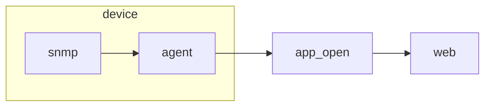

Cut out summary from your post content here.

<!--more-->

The remaining content of your post.
# 运维接口
## 数据流

1. 应用程序对接ipmi或snmp协议，从设备获取相关信息；
2. 应用程序按标准提供开放接口。

## 对接方案
### 硬件接口
1. IPMI
IPMI（Intelligent Platform Management Interface，智能平台管理接口）。它是由Intel、DELL、HP及NEC于1998年共同提出，同时，由IPMI论坛创建了IPMI标准依赖，并已经得到了170多家供应商的支，这使得其逐渐成为了一个完整地包括服务器和其他系统（如存储设备、网络和通信设备）的硬件管理规范。通过该规范，用户使用用IPMI协议监视服务器的物理健康特征，如温度、电压、风扇工作状态、电源状态等。
ipmi就是一个面向服务器的一个管理的开源协议，该协议规定了消息格式规范，对于不同的传输接口，消息格式会有所不同。同时，除了协议规定的标准命令外，还有预留了许多oem命令，用户可以根据实际需求实现oem命令。

2. snmp
SNMP（简单网关协议，Simple Network Management Protocol）是专门设计用于在 IP 网络管理网络节点（服务器、工作站、路由器、交换机及HUBS等）的一种标准协议，它是一种应用层协议。SNMP的前身是简单网关监控协议（SGMP），用来对通信线路进行管理。随后人们对SGMP进行了很大的修改，特别是加入了符合Internet定义的SMI和MIB，改进后的协议就是著名的SNMP。利用SNMP，一个管理工作站可以远程管理所有支持这种协议的网络设备，包括监视网络状态、修改网络设备配置、接收网络事件警告等。

### 对接方式
1. nagios

2. 自主实现
    本地实现状态获取，定期发送
    
调研nagios实现方式 